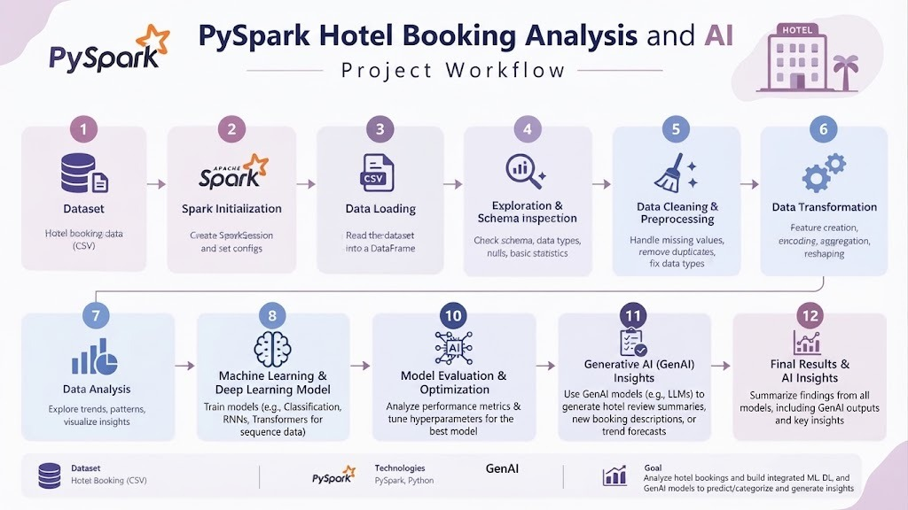

# Hotel Booking Analysis Using PySpark

## Project Overview

This project presents an end-to-end analysis of hotel booking data using **Apache PySpark**. The main goal is to process the booking dataset, understand customer and reservation patterns, prepare the data for predictive modeling, and apply different AI techniques to extract useful insights.

The project starts with loading and inspecting the hotel booking dataset, followed by data cleaning and preprocessing. Different data preparation techniques are applied to handle missing values, convert data types, and prepare categorical and numerical features for analysis and modeling.

## Project Flow

## What Was Done

### 1. Data Loading and Exploration

The hotel booking dataset was loaded and examined using PySpark DataFrames.

The initial analysis focused on:

* Understanding the structure of the dataset.
* Inspecting the available features.
* Checking data types.
* Identifying missing values.
* Examining the distribution of the data.
* Understanding the main characteristics of hotel reservations.

### 2. Data Cleaning and Preprocessing

The dataset was prepared for further analysis and modeling by performing data cleaning and preprocessing operations.

This included:

* Handling missing and inconsistent values.
* Converting columns to appropriate data types.
* Removing or transforming unsuitable values.
* Preparing categorical and numerical features.
* Organizing the dataset into a suitable format for modeling.

### 3. Exploratory Data Analysis

Exploratory analysis was performed to understand the relationships and patterns within hotel bookings.

The analysis examined factors such as:

* Booking and cancellation patterns.
* Customer characteristics.
* Length of stay.
* Number of guests.
* Booking lead time.
* Room and reservation information.
* Pricing-related features.
* Relationships between different booking attributes.

The purpose of this stage was to identify important patterns and determine which features could be useful for predictive modeling.

### 4. Feature Engineering

New features were prepared or transformed from the original dataset to make the data more suitable for Machine Learning and Deep Learning models.

This stage included transforming categorical variables and preparing numerical features so that they could be used as model inputs.

### 5. Machine Learning

Machine Learning models were applied to the processed hotel booking data to perform predictive analysis.

The prepared features were divided into training and testing data, allowing the models to learn from historical booking information and evaluate their performance on unseen data.

### 6. Deep Learning

A Deep Learning model was also developed using the processed dataset.

The prepared features were passed to a neural-network-based model to explore whether Deep Learning could capture more complex relationships within the hotel booking data.

### 7. Generative AI

Generative AI was incorporated as an additional analysis layer.

The processed results and identified patterns can be used to generate human-readable insights and help interpret the findings from the data and predictive models.

## Technologies Used

* Python
* Apache PySpark
* PySpark DataFrames
* PySpark ML
* Pandas
* Scikit-learn
* Keras / TensorFlow
* Generative AI
* Data Visualization

## Key Outcome

The project demonstrates a complete Big Data analytics workflow, starting from raw hotel booking data and progressing through **data processing, cleaning, exploratory analysis, feature engineering, Machine Learning, Deep Learning, and Generative AI**.

It demonstrates how PySpark can be used to process and prepare real-world booking data while combining traditional analytics with modern AI techniques.
